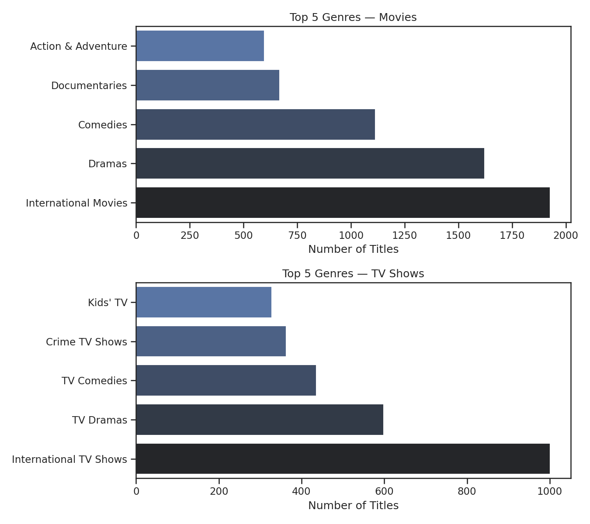
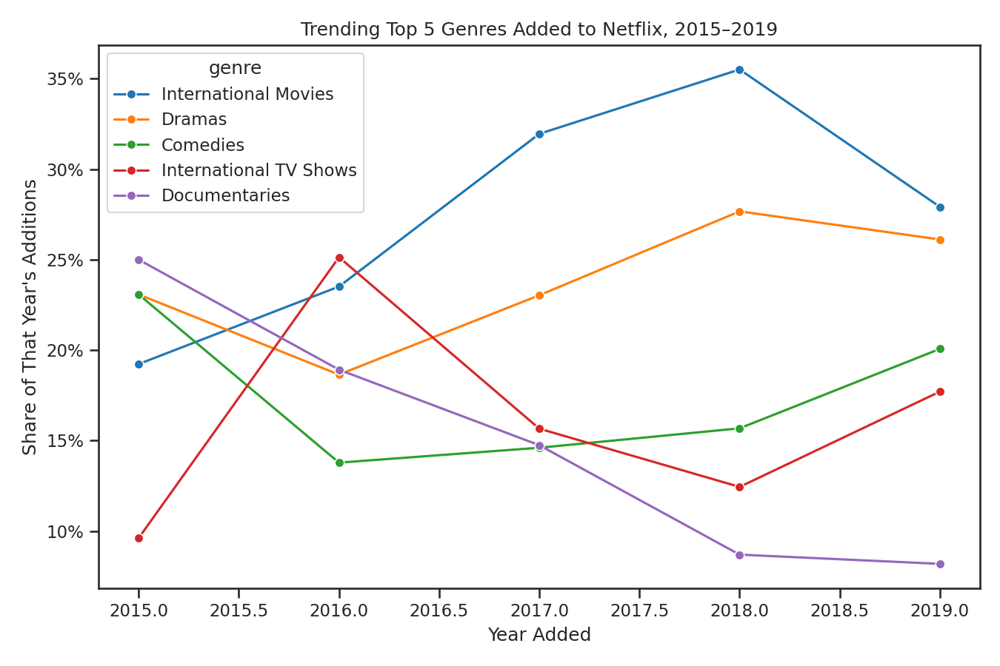
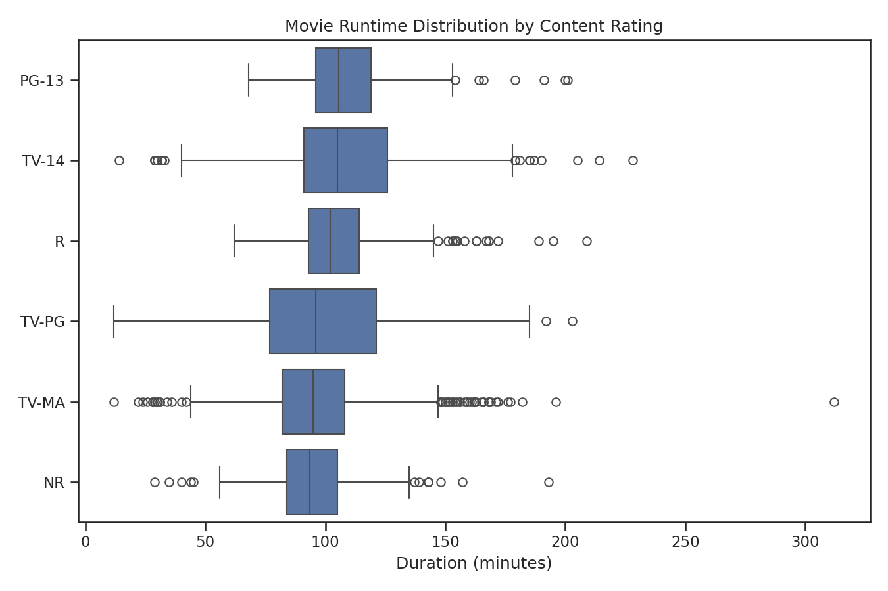
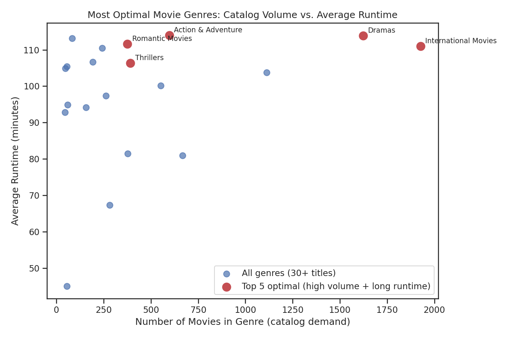

# Overview

Welcome to my analysis of Netflix's content catalog, focusing on movies and TV shows. This project was created to practice end-to-end exploratory data analysis in Python — going from a raw CSV to cleaned data, visualizations, and clear, decision-ready insights. It delves into the most in-demand genres, how content trends have shifted over time, and where genre volume meets genre "investment" (runtime) to find the catalog's most optimal genres.

The data is the well-known [Netflix Movies and TV Shows dataset](https://www.kaggle.com/shivamb/netflix-shows), containing 6,234 titles with details on type, genre, country, release year, date added, rating, and duration. Through a series of Jupyter notebooks, I explore key questions such as which genres dominate the catalog, how genre trends have moved year over year, and which genres represent Netflix's best mix of volume and production scale.

# The Questions

Below are the questions I want to answer in my project:

1. What are the most in-demand genres for Movies vs. TV Shows?
2. How are top genres trending as a share of new additions over time?
3. How does movie runtime vary by content rating?
4. What are the most optimal movie genres? (High Catalog Volume AND Long Average Runtime)

# Tools I Used

For my deep dive into Netflix's content catalog, I harnessed the power of several key tools:

- **Python:** The backbone of my analysis, allowing me to analyze the data and find critical insights. I also used the following Python libraries:
    - **Pandas Library:** This was used to clean and analyze the data.
    - **Matplotlib Library:** I visualized the data.
    - **Seaborn Library:** Helped me create more advanced visuals.
- **Jupyter Notebooks:** The tool I used to run my Python scripts which let me easily include my notes and analysis.
- **Visual Studio Code:** My go-to for executing my Python scripts.
- **Git & GitHub:** Essential for version control and sharing my Python code and analysis, ensuring collaboration and project tracking.

# Data Preparation and Cleanup

This section outlines the steps taken to prepare the data for analysis, ensuring accuracy and usability.

## Import & Clean Up Data

I start by importing necessary libraries and loading the dataset, followed by initial data cleaning tasks to ensure data quality.

```python
import pandas as pd
import seaborn as sns
import matplotlib.pyplot as plt

df = pd.read_csv('netflix_titles.csv')

# Parse the date a title was added to Netflix into a real datetime
df['date_added'] = pd.to_datetime(df['date_added'].str.strip(), errors='coerce')
df['year_added'] = df['date_added'].dt.year
```

## Explode Multi-Value Genres

A title can belong to more than one genre at once (e.g. `"Dramas, International Movies"`), so I split and "explode" the `listed_in` column into one row per title-genre pair before doing any genre-level counting. Without this step, genre counts would silently undercount every multi-genre title.

```python
df['genre_list'] = df['listed_in'].str.split(', ')
df_genres = df.explode('genre_list').rename(columns={'genre_list': 'genre'})
```

## Handle a Partial Final Year

The most recent `date_added` in the dataset is January 18, 2020 — meaning 2020 is a partial year, not a full one. I exclude it from any year-over-year trend analysis so a partial year doesn't look like a misleading drop-off.

# The Analysis

Each Jupyter notebook for this project aimed at investigating specific aspects of Netflix's content catalog. Here's how I approached each question:

## 1. What are the most in-demand genres for Movies vs. TV Shows?

To find the most in-demand genres, I split the exploded genre data by content type and got the top 5 genres for Movies and for TV Shows separately. This highlights which genres to pay attention to depending on the type of content being analyzed.

View my notebook with detailed steps here: [2_Genre_Demand](2_Genre_Demand.ipynb).

### Visualize Data

```python
fig, ax = plt.subplots(2, 1, figsize=(9, 8))

for i, t in enumerate(['Movie', 'TV Show']):
    top5 = df_genres[df_genres['type'] == t]['genre'].value_counts().head(5).sort_values()
    sns.barplot(x=top5.values, y=top5.index, ax=ax[i], hue=top5.index, palette='dark:b_r', legend=False)
    ax[i].set_title(f'Top 5 Genres — {t}s')

plt.show()
```

### Results



*Bar graphs visualizing the top 5 genres for Movies and for TV Shows separately.*

### Insights:

- **International Movies** (1,927 titles) and **Dramas** (1,623) are the two largest genres in the Movie catalog by a wide margin, together making up nearly 40% of all movies.
- On the TV Show side, **International TV Shows** (1,001) leads, followed by **TV Dramas** (599) and **TV Comedies** (436) — a similar international/drama-heavy pattern to the movie catalog.
- **Documentaries** and **Action & Adventure** round out the movie top 5, showing Netflix balances broad entertainment genres with a meaningful documentary presence.

## 2. How are top genres trending as a share of new additions over time?

To find how genre trends shifted year over year, I filtered to the top 5 overall genres and grouped by the year each title was added, tracking each genre's share of that year's additions from 2015–2019 (excluding the partial 2020 year).

View my notebook with detailed steps here: [3_Content_Trends](3_Content_Trends.ipynb).

### Visualize Data

```python
from matplotlib.ticker import PercentFormatter

pivot_pct = (pivot.div(pivot.sum(axis=1), axis=0) * 100)[top5]
sns.lineplot(data=pivot_pct, dashes=False, legend='full', palette='tab10', marker='o')

plt.gca().yaxis.set_major_formatter(PercentFormatter(decimals=0))
plt.show()
```

### Results



*Line graph visualizing the trending top 5 genres added to Netflix's catalog, 2015–2019.*

### Insights:

- **International Movies'** share of new additions climbed steadily from 19% of new titles in 2015 to a peak of 36% in 2018, reflecting Netflix's well-documented push into global content during that period, before settling back to 28% in 2019.
- **Documentaries'** share fell consistently, from 25% of new additions in 2015 down to about 8% by 2019 — even as the catalog overall grew far larger, documentaries became a smaller slice of what's new.
- **Dramas** stayed the most stable of the top 5, holding between roughly 23–28% of new additions every year — a reliable, evergreen category Netflix keeps investing in regardless of other shifts.

## 3. How does movie runtime vary by content rating?

To see how runtime (a proxy for production scale) varies, I isolated Movies, extracted the numeric minute value from the `duration` field, and compared the distribution across the 6 most common content ratings.

View my notebook with detailed steps here: [4_Duration_Analysis](4_Duration_Analysis.ipynb).

### Visualize Data

```python
sns.boxplot(data=movies[movies['rating'].isin(top_ratings)], x='duration_min', y='rating', order=order)

plt.show()
```

### Results



*Box plot visualizing movie runtime distribution for the 6 most common content ratings.*

### Insights

- **PG-13** and **TV-14** movies have the longest median runtimes (around 105 minutes), consistent with these ratings covering mainstream action, drama, and blockbuster-style films built for a full theatrical or prestige-TV runtime.
- **TV-MA** and **NR (Not Rated)** movies run noticeably shorter on average — TV-MA often includes stand-up comedy specials and edgier independent films, which tend to be tighter productions.
- The spread (box width) is fairly similar across ratings, meaning runtime variability isn't strongly tied to content rating — rating mainly shifts the *typical* runtime, not the *range* of runtimes.

## 4. What are the most optimal movie genres to focus on?

Combining insights from catalog volume and average runtime, this analysis pinpointed the genres that are both heavily represented in the catalog *and* command a long average runtime — the genres Netflix appears to be investing in most heavily.

View my notebook with detailed steps here: [5_Optimal_Genres](5_Optimal_Genres.ipynb).

### Visualize Data

```python
plt.scatter(genre_summary['count'], genre_summary['avg_duration'])
plt.show()
```

### Results



*A scatter plot visualizing the most optimal movie genres (high catalog volume & high average runtime), with the top 5 highlighted.*

### Insights:

- **International Movies** and **Dramas** stand out as the clear "optimal" genres — both post huge catalog volume (1,600–1,900+ titles) *and* above-average runtime (110+ minutes), meaning Netflix isn't just adding a lot of these, it's investing in full-length productions within them.
- **Action & Adventure** and **Romantic Movies** have the longest average runtimes of any genre (110–114 minutes) despite moderate catalog volume (~375–600 titles), making them efficient, high-production-value additions.
- **Documentaries** and **Stand-Up Comedy** sit at the opposite end — solid catalog volume but the shortest average runtimes (67–81 minutes) — useful for filling out variety, but not where Netflix is putting its longest-form productions.

# What I Learned

Throughout this project, I deepened my understanding of exploratory data analysis in Python and enhanced my technical skills. Here are a few specific things I learned:

- **Handling Multi-Value Columns:** Learned to use `str.split()` + `explode()` to correctly count categorical data where a single record can belong to multiple categories at once — a common real-world data shape that naive `value_counts()` gets wrong.
- **Spotting Partial-Period Bias:** Caught that the dataset's final year was incomplete before it could distort a trend line, reinforcing the habit of checking a date column's actual range before trusting any year-over-year comparison.
- **Adapting an Analysis Pattern to a New Domain:** Took the "demand vs. value" analytical structure from a job-market context and reapplied it to a media catalog — proof that the underlying analytical thinking (not just the specific dataset) is the transferable skill.

# Insights

This project provided several general insights into Netflix's content strategy:

- **Genre Concentration**: A small handful of genres — International Movies, Dramas, and their TV Show counterparts — dominate the catalog by volume, on both the Movie and TV Show side.
- **Shifting Trends**: Netflix's genre mix isn't static; International Movies grew sharply as a share of new additions through 2018 while Documentaries steadily shrank, reflecting a real strategic shift toward global content.
- **Volume vs. Production Scale**: The genres with the most titles aren't always the ones with the longest average runtime — Documentaries and Stand-Up Comedy have solid volume but short runtimes, while Action & Adventure and Romantic Movies punch above their weight on runtime despite smaller catalogs.

# Challenges I Faced

This project was not without its challenges, but it provided good learning opportunities:

- **Multi-Value Fields**: Genres, cast, and country were all stored as comma-separated strings in single columns, requiring careful splitting and exploding before any grouping could be trusted.
- **Incomplete Final Period**: Recognizing and correctly excluding the partial 2020 data from the trend analysis, rather than letting it silently distort the picture.
- **Choosing a Meaningful "Value" Metric**: Without a salary-like field, deciding that runtime was the most defensible proxy for production investment took some thought — and I made sure to state that assumption clearly rather than imply runtime literally means "value."

# Conclusion

This exploration into Netflix's content catalog was a great exercise in applying a proven analytical framework — demand, trend, distribution, and "optimal" combination — to a brand-new domain and dataset. The insights highlight how Netflix's genre strategy has shifted over time and which genres represent the best mix of scale and production investment. This project reinforced that strong analytical thinking transfers across datasets, and it's a pattern I can bring to any new dataset a data analyst role would hand me.
